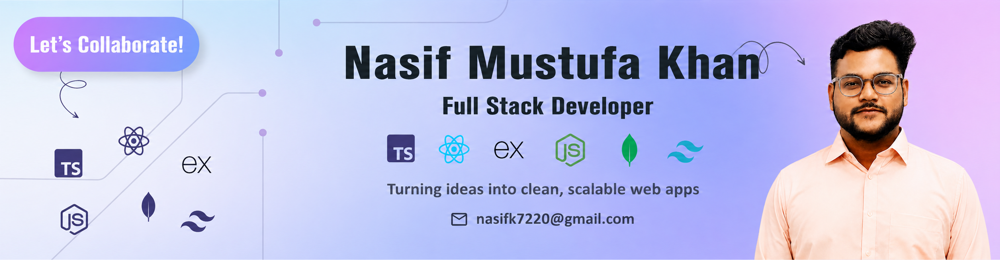

<!-- ===================== PROFILE HEADER ===================== -->

<h1 align="center">Hi 👋, I'm Nasif Mustufa Khan</h1>

<h3 align="center">
  Aspiring Full-Stack Web Developer | AI-Driven Web Engineering Learner
</h3>

  <em>
    Learning by building projects, solving problems, and continuously improving my development skills.
  </em>

  

---

<!-- ===================== ABOUT ME ===================== -->

<h2>🚀 ABOUT ME:</h2>

- 🔭 Currently learning **JavaScript, TypeScript, React, Node.js & MERN Stack**
- 🌱 Currently focusing on **TypeScript & React**
- 💻 Building projects to strengthen my **web development fundamentals**
- 🤖 Exploring **AI-Assisted Development & AI-Driven Engineering**
- 📚 Improving my skills through **problem solving and hands-on projects**
- 👨‍💻 All of my projects are available on my GitHub [nasifmustufakhan7220](https://github.com/nasifmustufakhan7220?tab=repositories)
- 📫 Reach me at **nasifk7220@gmail.com**
- ⚡ Fun fact: **I love coding and learning new technologies**

---

<!-- ===================== SOCIALS ===================== -->

<h2>💬 FOLLOW ME ON SOCIALS:</h2>

---

<!-- ===================== TECHNOLOGY STACK ===================== -->

<h2>🛠️ TECHNOLOGY STACK:</h2>

### Languages:

### CSS Frameworks & Libraries:

### JavaScript Frameworks & Libraries:

### Database & Backend:

### Tools & Technologies:

---

<!-- ===================== CURRENTLY LEARNING ===================== -->

<h2>📚 CURRENTLY LEARNING:</h2>

- TypeScript
- React
- Node.js
- MERN Stack
- AI-Assisted Coding
- AI-Driven Web Engineering

---

<!-- ===================== GITHUB STATISTICS ===================== -->

<h2>📊 GITHUB STATISTICS & ANALYSIS:</h2>

### GitHub Contributions:

  

### GitHub Statistics:

## Most Used Languages:

### GitHub Streak:

---

<!-- ===================== CURRENT FOCUS ===================== -->

<h2>🎯 CURRENT FOCUS:</h2>

<strong>
Building → Learning → Practicing → Improving → Repeating 🚀
</strong>

---

<h3 align="center">
Thanks for visiting my profile! ⭐
</h3>

Feel free to explore my repositories and follow my learning journey.

